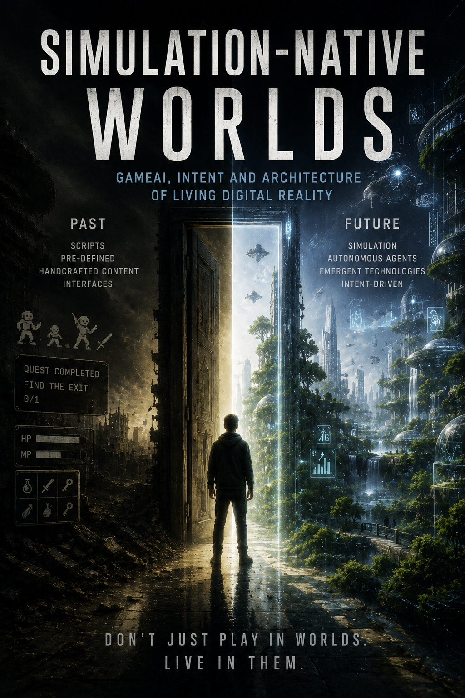

# Simulation‑Native Worlds  
### GameAI, Intent and the Architecture of Living Digital Reality

  

---

## 🌍 Vision
A new architectural model for digital worlds built not from scripts, triggers, or handcrafted logic — but from **matter**, **agents**, and **intentions**.  
Simulation‑Native Worlds explore how environments can behave, evolve, and persist through physical causality and autonomous processes.

This is not a technical manual.  
This is the conceptual foundation for worlds that don’t wait for the player — worlds that *exist*.

---

## 🔧 Core Concepts

### 🪨 **Matter**
Worlds composed of physical properties, not static objects.  
Fire spreads, water flows, materials deform, structures fail — all through honest physics.

### 🧍 **Agents**
NPCs as autonomous bodies inside the same physical reality as the player.  
They perceive, decide, act, and leave consequences.

### 🎯 **Intentions**
A semantic interface where the player expresses meaning, not commands.  
Intent becomes action through physical primitives and procedural motion.

### 🔄 **Adaptive Simulation**
Full detail near the player, abstract but honest processes at a distance.  
The world never pauses — it keeps living.

---

## 🌱 Why It Matters
Simulation‑Native Worlds redefine how digital environments are created and experienced:

- emergent behavior instead of scripted events  
- long‑term consequences instead of static states  
- real creativity through matter, not recipes  
- NPCs that live their own lives  
- worlds that evolve even when unseen  

This architecture shifts the player’s role from “center of the universe” to **participant in a living system**.

---
## 📚 Simulation‑Native Worlds — Book Series

### Published
📘 **SNW I — Worlds of Native Simulation**  
[docs/SNW-I.pdf](docs/SNW-I.pdf)

### Upcoming
*(Add links here when new volumes are ready)*
---

## ✍️ Author
**Siragudin Guseynov**

---

> “Don’t play worlds. Live in them.”
